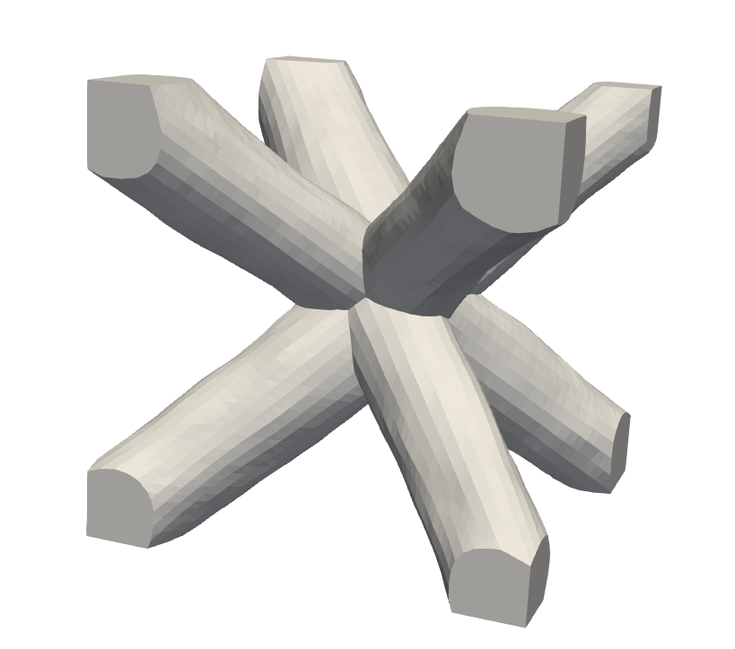

# pyLattice ↔︎ Pyrough compatibility
Combining the design capabilities of **pyLatticeDSO** with the surface roughness control provided by **Pyrough** 
enables the generation of truss lattice structures with rough beam surfaces.
This integration allows users to investigate the influence of surface roughness on the mechanical behavior of lattice structures, which is of major interest for applications in additive manufacturing and materials science.

---
## Installation
To use **pyLatticeDSO** with **Pyrough**, install pyLatticeDSO as a submodule inside your Pyrough repository:

```bash
git submodule add https://github.com/jamodeo12/Pyrough.git Pyrough/
```
Additional dependencies are required to handle the increased mesh complexity of lattice structures.
From the Pyrough root directory, run:
```bash
pip install trimesh manifold3d
```

## Usage
To generate a rough lattice structure, two input files are required:
1. A lattice geometry definition file created for **pyLatticeDSO**
2. A roughness parameter file processed by **Pyrough**

Sample files are provided in:
- `examples/BCC_cell.json` (lattice geometry)
- `examples/lattice_wire.json` (roughness configuration)
From the Pyrough root directory, run:
```bash
python Pyrough.py .\examples\lattice_wire.json
```
This command generates a rough lattice structure using the lattice geometry defined in `BCC_cell.json` and applies the surface roughness parameters specified in `lattice_wire.json`.
The image below illustrates a BCC lattice structure with rough beam surfaces generated using this approach:


See the [Pyrough documentation](https://jamodeo12.github.io/Pyrough/) for more details on configuring roughness parameters and additional functionalities.
