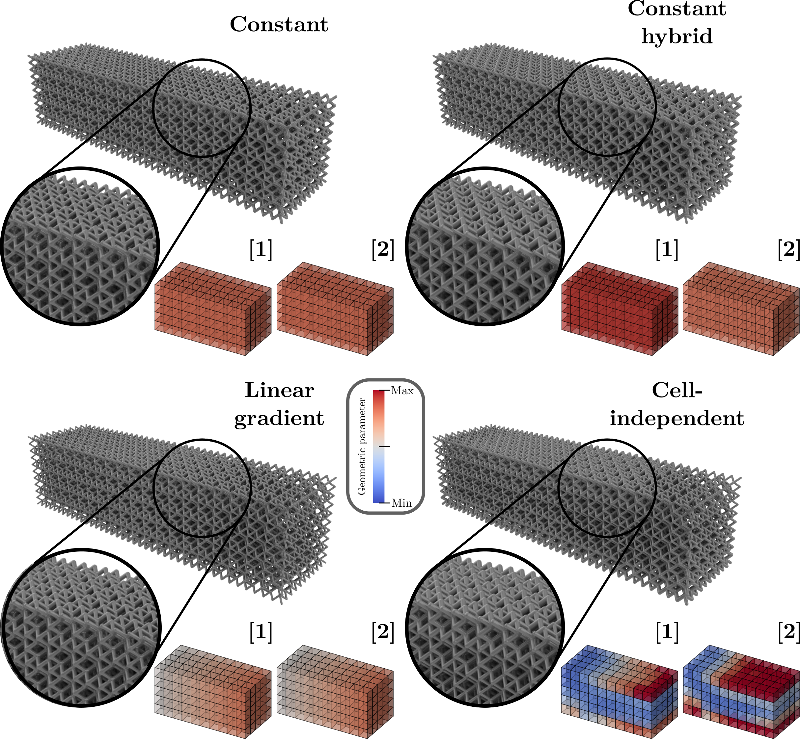

# Optimization Methods 
In this framework, we provide a variety of possibilities for optimizing lattice structures. 
Each simulation method presented in the [simulation methods guide](simulation_methods.md) can be used as a solver in an optimization loop.
Optimizing the compliance of the structure, minimizing weight while maintaining stiffness, or targeting specific mechanical properties are common objectives.
Optimizing lattice structures can be performed at different levels, from tuning parameters of the entire lattice 
structure at once to optimizing individual unit cells or specific regions within the lattice.
Some of the optimization methods implemented in pyLatticeDSO are presented in the image below:

The image illustrates a comparison of the optimization methods applied to a configuration composed of geometries~
[BCC,Hybrid1].The colored voxel geometries illustrate the spatial arrangement of the different geometry types within 
each structure, with colors indicating the geometric parameter (here beam radius) from minimum (blue) to maximum (red).
## Gradient-Based Optimization
Gradient-based optimization methods utilize the sensitivity of the objective function with respect to design variables to iteratively improve the design.
These methods are particularly effective for problems with a large number of design variables, such as lattice structures where each beam's dimensions can be adjusted.
In pyLatticeDSO, we implement gradient-based optimization techniques that leverage the domain decomposition method 
combined with derivable surrogate models to efficiently compute gradients and update design variables.
This approach allows for rapid convergence to optimal designs while managing the computational complexity associated with large lattice structures.
Thats why the cell-independant optimization method presented in the previous figure can be performed in a few 
minutes only (26 min) compared to the same method without efficient gradient computation (8h).

#  Optimization Methods

`pyLatticeDSO` offers a flexible framework for the design optimization of lattice structures. By combining high-fidelity solvers with efficient optimization loops, you can tailor mechanical properties to meet specific engineering requirements.

---

##  Optimization Objectives

Every simulation backend presented in the [Simulation Methods Guide](simulation_methods.md) can be integrated as a solver within an optimization loop. Common objectives include:

* **Compliance Minimization**: Maximizing overall structural stiffness under a given load.
* **Weight Reduction**: Minimizing material volume while respecting stress or displacement constraints.
* **Property Targeting**: Reaching specific effective properties (e.g., matching a target elasticity tensor).

---

##  Multi-Level Optimization Strategies

Optimization can be performed at different scales, depending on the design freedom required:

| Level | Description | Design Variables                             |
| :--- | :--- |:---------------------------------------------|
| **Global** | Uniform parameters across the entire lattice. | Global scaling, uniform beam radii.          |
| **Regional** | Optimization by zones or functional groups. | Gradient-based.                              |
| **Cell-Specific** | Independent optimization for every single unit cell. | Individual beam radii, local geometry types. |


*Figure 1: Comparison of optimization levels on a [BCC, Hybrid1] configuration. Colors represent the beam radius from minimum (blue) to maximum (red).*

---

## ⚡ Gradient-Based Optimization

Gradient-based methods are the core of `pyLatticeDSO` for handling high-dimensional design spaces. They utilize the **sensitivity (gradients)** of the objective function to navigate toward the optimal solution efficiently.

### The Power of DDM & Surrogates
For structures with thousands of beams, standard optimization is often computationally prohibitive. Our framework solves this by coupling:
1.  **Domain Decomposition (DDM)**: Breaking the large system into unit cells.
2.  **Differentiable Surrogate Models**: Providing near-instantaneous gradients of the cell's mechanical response.

> **_"Performance Benchmark"_** 
    The use of efficient gradient computation through surrogate models reduces the optimization time of a cell-independent structure from **8 hours** to only **26 minutes**.


---

##  Usage Example

Here is a conceptual snippet of how to set up a gradient-based optimization:

```python
from pyLatticeDesign.plotting_lattice import LatticePlotting
from pyLatticeOpti.lattice_opti import LatticeOpti


path = "optimization/"
name_file = "Cantilever_L_beam"


lattice_object = LatticeOpti(path + name_file, verbose=1, convergence_plotting = True)

lattice_object.optimize_lattice()

# Visualization optimized lattice
vizualizer = LatticePlotting()
vizualizer.visualize_lattice(lattice_object, beam_color_type="radii", enable_boundary_conditions=True)
```
with the JSON file defining the optimization parameters:
```json
"optimization_informations": {
      "objective_function": "min",
      "objective_type": "compliance",
      "max_iterations": 50,
      "optimization_parameters": {
        "type": "unit_cell",
        "hybrid": true
      },
      "constraints": {
        "relative_density": {
          "value": 0.3,
          "compute_gradient": true
        }
      },
      "enable_parameter_normalization": true,
      "simulation_type": "DDM",
      "enable_gradient_computing": true
  }
```