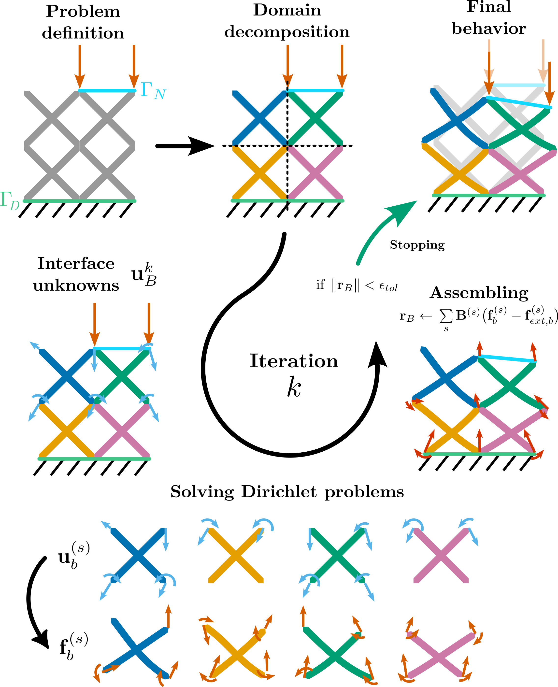

# Simulation methods in pyLatticeDSO
pyLatticeDSO offers two simulation methods to analyze and optimize truss lattice structures. The most used method is 
the Finite Element Method (FEM), which provides accurate results for structural analysis. Additionally, pyLatticeDSO 
includes a more efficient method based on domain decomposition, which is particularly useful for large-scale lattice structures where computational efficiency is crucial.
## Finite Element Method (FEM)
The Finite Element Method (FEM) is a numerical technique used to solve complex structural problems by discretizing the structure into smaller, manageable elements. In pyLatticeDSO, the FEM is implemented to analyze the mechanical behavior of truss lattice structures under various loading conditions.

### Beam Elements
In pyLatticeDSO, truss lattice structures are modeled using beam elements. Each beam element represents a segment of 
the lattice and is defined by its material properties, cross-sectional area, and moment of inertia. The beam 
elements are connected at nodes, which represent the junctions of the lattice. Timoshenko beam theory is employed to account for both bending and shear deformations, providing a more accurate representation of the structural behavior.
However, the joint stiffness is not accurately modeled for lattice structures, as shown in [Gümrük and
Mines 2013](https://www.sciencedirect.com/science/article/pii/S0020740313000118), [H. Guo et al. 2020](https://www.sciencedirect.com/science/article/pii/S0927025620301014), [Labeas and Sunaric 2010](https://onlinelibrary.wiley.com/doi/abs/10.1111/j.1475-1305.2008.00498.x), [Tahmasebimoradi et al. 2021](https://hal.science/hal-03970478).
In this librairy, the method developed in [Cadart, T., T. Hirschler, S. Bahi, S. Roth, F. Demoly, et N. Lebaal. «An 
Optimal Penalty Method for the Joint Stiffening in Beam Models of Additively Manufactured Lattice Structures». 
International Journal of Solids and Structures 306 (2025): 113107. ](https://doi.org/10.1016/j.ijsolstr.2024.113107) is implemented to improve the accuracy of joint stiffness modeling.
Two parameters are introduced to calibrate the joint stiffness:
- L_zone: Length of the zone around each node where the joint stiffness correction is applied. This parameter is 
  defined with an equation depending of the radius of the beam and the angle between the beams connected to the node.
- alpha_r: A penalty coefficient that scales the stiffness correction applied in the L_zone.
These parameters is adjusted based on experimental data and detailed numerical simulations to achieve the best accuracy.

## Domain Decomposition Method
The Domain Decomposition Method (DDM) is an efficient computational technique that divides a large problem into smaller subproblems, which can be solved independently and in parallel. In pyLatticeDSO, the DDM is implemented to analyze large-scale truss lattice structures more efficiently.
The DDM approach in pyLatticeDSO involves partitioning the lattice structure into smaller subdomains, each of which can be analyzed separately. The subdomains are connected through interface conditions that ensure continuity and equilibrium across the boundaries. This method significantly reduces the computational cost and time required for simulating large lattice structures, making it suitable for optimization tasks where multiple simulations are needed.
### Methodology
The DDM in pyLatticeDSO follows these steps:
The iterative process is described as follows:
1. Define the global problem, including geometry, boundary conditions, and loading conditions.
2. Decompose the global problem into smaller subdomains (cells of the lattice structure) and build local FE operators for each subdomain.
3. Initialize the interface unknowns (displacements and rotations at interface nodes).
4. Solve each subdomain independently by evaluating the equilibrium of each subdomain through a Dirichlet problem.
5. Assemble reaction forces and moments on the interfaces and test the equilibrium of the interface loads.
6. Update the interface variables based on the residual of the interface efforts. If the residual is below a specified tolerance, the overall solution is achieved; otherwise, repeat the process.
See the following illustration of the DDM process:

## Surrogate Modeling for Lattice Simulation

The **Domain Decomposition Method (DDM)** in `pyLatticeSim` has been enhanced with **Surrogate Models** (metamodels) to bypass the expensive computation of the Dirichlet problem on every unit cell.

---

###  Concept
Instead of performing a full Finite Element Analysis (FEA) for each cell during the Schur complement construction, the system "predicts" the mechanical response based on a pre-computed database. This approach bridges the gap between high-fidelity simulation and real-time performance.

---

### Supported Interpolation Methods

Multiple surrogate backends are implemented to handle different types of data distribution:

| Method | Key Advantage | Typical Use Case |
| :--- | :--- | :--- |
| **Nearest Neighbor** | Extremely fast | Large, dense datasets with discrete parameters. |
| **Linear Interpolation** | Reliable and stable | Smooth, continuous variations in lattice geometry. |
| **Radial Basis Function (RBF)** | High accuracy for non-linearities | Complex behaviors with scattered or sparse data points. |

---

###  Performance Impact
By combining Domain Decomposition with surrogate modeling, the computation of large-scale lattice structures is significantly accelerated:
* **Pre-computation**: Done once per cell type.
* **Online Phase**: Assembling the global stiffness matrix becomes a simple interpolation task rather than a series of PDE solves.
* **Scalability**: Allows for the simulation of millions of struts in minutes.

